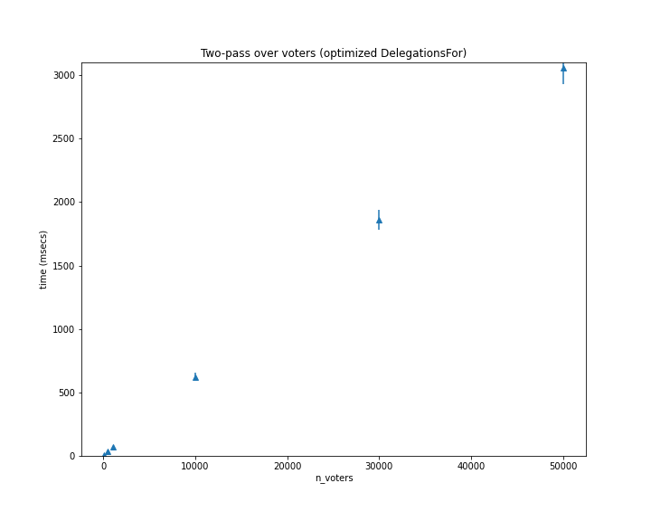
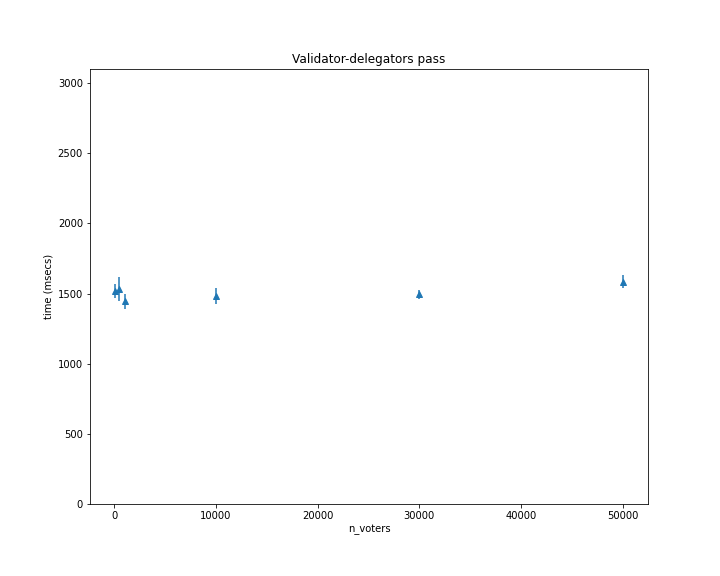

# ADR 0020: Governance Support for Delegator Votes

## Component

Oasis Core

## Changelog

- 2022-11-07: Minor updates. Added Cosmos-SDK implementation note.
- 2022-11-03: Added benchmarks, minor updates.
- 2022-11-02: Initial draft.

## Status

Accepted

## Context

With the current governance voting mechanism ([ADR 04]), only the active
validator set is participating in voting. This means that the validators are
voting on behalf of all their delegators. This ADR proposes a change so that
each delegator is able to vote with its own stake. The delegators vote acts as
an override of the validator vote.

## Decision

### Casting Votes

In the current implementation the submitter of a vote needs to be a part of the
active validator committee at the time the vote is cast. This requirement is
relaxed so that additionally anyone with a delegation to an active validator
committee entity can vote.

This change requires an efficient `staking.DelegationsFor` query to obtain a
list of accounts the submitter is delegating to. Staking state is updated with:

```go
// delegationKeyReverseFmt is the key format used for reverse mapping of
// delegations (delegator address, escrow address).
//
// Value is CBOR-serialized delegation.
delegationKeyReverseFmt = keyformat.New(0x5A, &staking.Address{}, &staking.Address{})
```

`state.SetDelegation` function is updated to store both `delegationKeyFmt` and
the reverse `delegationKeyReverseFmt`. `DelegationsFor` query function is
updated to use the added reverse mapping.

For completeness the same can be done for debonding delegations, although not
necessary for the governance changes proposed in this ADR.

#### Alternative solutions

Possible alternatives that would avoid adding the reverse mapping are:

- Querying `DelegationsTo` for each validator. This results in `num_validators`
  queries per cast vote transaction which is still too much.
- Allowing anyone to cast votes. Potentially a viable solution, but this could
  result in the number of voters growing uncontrollably large. This might be ok,
  if the vote tallying procedure would ignore those votes. However the votes
  state could still grow problematically big.

### Vote tallying

When a proposal closes, the vote tallying procedure changes to:

```
# Two-pass over votes approach.
1  Tally up the validator votes (as it is already implemented) # First pass.
2  For each of the voters do:                                  # Second pass.
3    For each of the entities voter delegates to:
4      Skip non validator entities
5      Skip if voter's vote matches the delegation entity vote
6      Compute stake from the delegation shares
4      If delegation entity voted, subtract the stake from the delegation entity vote tally
5      Add computed stake to the voter's vote tally
```

- Possbile variant: instead of using `DelegationsFor` query in step 3), a map of
  all validator delegators could be prebuild, by using `DelegationTo` for each
  of the validators. Even with the efficient `DelegationsFor` query, this can be
  beneficial IF the number of voters is large.

This procedure iterates over all voters and can be beneficial if the number of
voters is relatively low compared to the number of all validator delegators.

#### Alternative Vote Tallying procedures

A possible alternative would be to iterate over the delegators-validator sets:

```
# Delegators-validator pass approach.
1 Precompute stakes for all delegators to validators from shares.
2 For each validator
3   For each delegator to the validator
4     IF validator and delegators votes match (or delegator didn't vote)
5       Add delegator stake to the validator's vote (or nothing if validator didn't vote)
6     IF validator and delegator vote don't match
7       Add delegator stake to the delegator's vote (or nothing if delegator didn't vote)
```

The voting procedure now iterates over all delegators of the active validator
set. The amount of work is somewhat predictable as it doesn't depend on the
number of voters but on the delegators-to-validator sets. However the number of
votes is bound by the size of the delegators-to-validator set and in realistic
scenario likely much smaller.

#### Implementations in other chains

Cosmos-SDK uses a similar approach to the proposed solution in the ADR. The
tallying iterates over voters, their delegations and validators. For detailed
implementation see: [Cosmos-SDK Vote Tallying Code]. The voting itself is
limited to delegators (similar as proposed in this document).

#### Benchmarks

The Vote Tallying procedure variants were benchmarked on mainnet data.

Some basic stats from mainnet:

- 120 validators
- ~49500 eligible voters (unique delegators to validators)
- average number of delegations-to per account is 1

The variants were benchmarked in scenarios with different number of voters. In
all scenarios the mainnet consensus state was used, only the number of
(simulated) voters varied. All votes were eligible (had at least one delegation
to an active validator) and all of the delegator votes did override the
validator votes.

The three tested variants were:

- "Two pass over voters (optimized DelegationsFor)" - as described in the
  proposed Vote tallying solution. Reverse mapping key is used for the
  `DelegationsFor` queries (described in Casting Votes section).
- "Two pass over voters (pre-build validator escrow)" - as described in the
  proposed Vote tallying solution with modification of prebuilding a map of all
  validator delegators (mentioned in the "Possible variant" section).
- "Validator-delegators" - as described in the alternatives section.





The above results show that:

- Two-pass approach (querying `DelegationsFor` for every voter) is fastest up to
  about 25000 voters for a proposal. In the worst case (every eligible voter
  voted) it is about twice as slow as the alternatives. In that case the
  tallying took about 3 seconds.
- The two-pass approach using pre-built map of all validator delegators is
  comparable to the "Validator-delegators" procedure. This makes sense as in
  both cases the main work is done in querying the delegators of validators.

In reality, the number of voters will likely be small compared to the eligible
set of all delegators, so the two-pass approach (with querying `DelegationsFor`
for every voter) seems to make the most sense.

If number of voters ever becomes problematic, the method could also implement a
heuristic to use the prebuilt validator-delegators map when the number of voters
is large (e.g. number of voters > 1/2 eligible delegators), but at the moment
there is no efficient way to query the number of all delegators.

### Pruning

With the possibility of increased number of votes per proposal a pruning of
votes can be implemented. Votes for a proposal can be pruned as soon as the
first block after the proposal is closed. Because proposal is closed in the
`EndBlock` state (which includes votes received in this last block), the pruning
should not be done before the block after, so that the exact state at the time
of the closing can be queried.

### Voting via messages

Delegator can also be a runtime. For enabling runtimes to vote, casting votes
should also be supported via runtime messages.

Roothash message type is updated to include governance message field:

```go
type Message struct {
  Staking    *StakingMessage    `json:"staking,omitempty"`
  Registry   *RegistryMessage   `json:"registry,omitempty"`
  Governance *GovernanceMessage `json:"governance,omitempty"`
}

// GovernanceMessage is a governance message that allows a runtime to perform governance operations.
type GovernanceMessage struct {
  cbor.Versioned

  CastVote *governance.ProposalVote `json:"cast_vote,omitempty"`
}
```

Governance backend is updated to handle the cast vote message.

For completeness, support for submitting proposals via runtime messages can also
be implemented.

## Consequences

### Positive

- Delegators are able to override validators vote. In the case of unresponsive
  validators this increases the voting participation.
- Delegators are able to vote with their own stake.
- (if implemented) Staking `DelegationsFor` queries are now efficient and don't
  require scanning the full delegations state.

### Negative

- This increases the complexity of the vote tallying procedure.
- This increases the size of the governance votes state.
- This increases the complexity and size of the consensus staking state if the
  `DelegationsFor` reverse mapping is implemented.

### Neutral

<!-- markdownlint-disable line-length -->
[ADR 04]: ./0004-runtime-governance.md
[Cosmos-SDK Vote Tallying Code]:
  https://github.com/cosmos/cosmos-sdk/blob/dc004c85f2e8b8fb4f66caac2703228c5bf544cf/x/gov/keeper/tally.go#L37-L90
<!-- markdownlint-enable line-length -->
